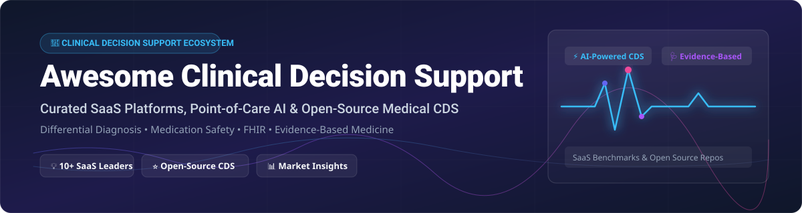

# Awesome Clinical Decision Support (CDS) 🩺 💡 🏥

  

  
  
  
  
  

---

## 📌 Top Clinical Decision Support (CDS) Platforms & Healthcare AI Ecosystem 🚀

**A Curated List of SaaS Products, Point-of-Care Medical AI & Open-Source GitHub Projects**  
*Focused on Evidence-Based Clinical Reference, Differential Diagnosis (DDx), Medication Safety & Terminology Infrastructure.*  
**Last updated: September 2026** 📅

---

### 🔍 Overview & Market Context 📈

This repository tracks notable **SaaS platforms** and **open-source GitHub projects** for **Clinical Decision Support (CDS)**. These medical AI and decision-support tools help clinicians access evidence-based medical knowledge, generate differential diagnoses, check drug-drug interactions, analyze patient risks, and make informed decisions at the point of care.

> 📊 **Estimated Market Size & Sector Structure**:  
> The global Clinical Decision Support Systems (CDSS) market size is estimated at **$5.2 Billion in 2024** and is projected to reach **$11.8 Billion by 2032** growing at a CAGR of **10.8%**. The market is **moderately fragmented**, featuring established enterprise publishing giants (Wolters Kluwer, Elsevier, EBSCO) alongside fast-growing AI-native point-of-care category leaders (OpenEvidence, Infermedica, VisualDx).

---

## 📑 Table of Contents

- [🏢 SaaS & Hosted CDS Platforms](#-saas--hosted-cds-platforms)
- [💻 Open-Source GitHub Projects](#-open-source-github-projects)
- [🛠️ Terminology & Drug Databases](#%EF%B8%8F-terminology--drug-databases)
- [🤝 How to Contribute](#-how-to-contribute)
- [💖 Support & Sponsorship](#-support--sponsorship)
- [📈 Star History](#-star-history)
- [⚠️ Disclaimer](#%EF%B8%8F-disclaimer)

---

## 🏢 SaaS & Hosted CDS Platforms

The table below summarizes commercial Clinical Decision Support (CDS) SaaS platforms, sorted by estimated company scale (annual revenue/valuation descending).

| Platform / Product | Description 📝 | Company Size (Revenue / Valuation) 💰 | Starting Paid Tier Pricing 💵 | Free Tier / Free Trial Limits 🎁 |
| :--- | :--- | :--- | :--- | :--- |
| **[Wolters Kluwer UpToDate](https://www.wolterskluwer.com/en/solutions/uptodate)** | Market-leading evidence-based point-of-care clinical reference; includes UpToDate Enterprise Edition with AI-Enhanced Search. | **$6.3 Billion** annual revenue (Wolters Kluwer Health division ~$1.6B) | **$59/month** (or ~$579/year individual physician subscription) | **No free tier**; individual 30-day institutional trial periods upon request. |
| **[Elsevier ClinicalKey AI](https://www.elsevier.com/products/clinicalkey/ai)** | AI-powered clinical search tool with exact paragraph citation traceability across Elsevier medical journals and textbooks; SMART on FHIR ready. | **$3.8 Billion** annual revenue (RELX / Elsevier segment) | **$49/month** (starting individual tier for ClinicalKey) | **No free tier**; 14-day institutional trial available for verified hospital networks. |
| **[EBSCO DynaMed](https://www.dynamed.com/)** | Evidence-based CDS with explicit Level 1-3 grades of evidence; DynaMedex suite integrates Micromedex drug data and Isabel DDx. | **$2.1 Billion** estimated parent revenue (EBSCO Industries) | **$399/year** (individual clinician tier) | **7-day free trial** with email registration; no permanent free tier. |
| **[Epocrates](https://www.epocrates.com/)** | Mobile-first drug interaction, dosing, black box warning, and clinical reference app widely used by U.S. prescribers. | **$1.2 Billion** parent valuation (at acquisition by Athenahealth / Veritas Capital) | **$16.99/month** ($179.99/year for Epocrates Plus premium) | **Free basic tier** (includes basic drug interaction checker, pill identifier, & guidelines). |
| **[OpenEvidence](https://www.openevidence.com/)** | Most widely used patient-aware medical AI clinical decision assistant in the U.S.; EHR integration with Epic & Cedars-Sinai. | **$450 Million** valuation (Series B medical AI unicorn) | **$30/month** (for non-physician/commercial enterprise seats) | **100% Free** for all NPI-verified U.S. licensed clinicians (physicians, PAs, NPs). |
| **[VisualDx](https://www.visualdx.com/)** | Visual clinical decision support system specializing in dermatology and diagnostic imaging with 50,000+ medical images. | **$45 Million** estimated annual revenue | **$49.99/month** (or $499/year individual subscription) | **30-day free trial** for mobile and web; no permanent free tier. |
| **[Zynx Health](https://www.zynxhealth.com/)** | Evidence-based clinical order sets and care plan templates for primary and acute care management. | **$35 Million** estimated annual revenue (Subsidiary of Hearst Health) | **$2,500/year** (starting organizational license) | **14-day demo access** for clinical directors; no free public tier. |
| **[Infermedica](https://infermedica.com/)** | API-first medical triage and symptom checker engine with NLP endpoint for free-text medical concepts. | **$20 Million** total funding / ~$150M valuation | **$490/month** (Developer API plan starting tier) | **Free Developer tier** (up to 100 API calls/month for testing). |
| **[Isabel Healthcare](https://www.isabelhealthcare.com/)** | Peer-reviewed differential diagnosis (DDx) generator with high accuracy using minimal clinical inputs. | **$12 Million** estimated annual revenue | **$28.99/month** (or $289.99/year individual clinician rate) | **30-day free trial** for individual medical professionals. |
| **[DXplain](http://dxplain.org/)** | MGH-developed classic decision support tool featuring case analysis and dynamic disease comparison across 4,000+ terms. | **$5 Million** research/institutional backing (Mass General Brigham) | **$40/year** (individual subscription fee) | **30-day free trial** for medical students & residents upon institutional verification. |

---

## 💻 Open-Source GitHub Projects

Below is a curated collection of open-source Clinical Decision Support (CDS) engines, EHR integrations, and medical AI systems, **sorted by GitHub star count (descending)**. 

| Repository 📦 | Description & Key Features 🧠 | GitHub Stars ⭐ |
| :--- | :--- | :--- |
| **[openemr/openemr](https://github.com/openemr/openemr/stargazers)** | ONC-certified open-source EHR & medical practice management system with integrated Clinical Decision Support (CDS) rules engine. |  |
| **[medplum/medplum](https://github.com/medplum/medplum/stargazers)** | Headless open-source developer platform for healthcare with FHIR server, SMART-on-FHIR, and custom CDS bot execution infrastructure. |  |
| **[openmrs/openmrs-core](https://github.com/openmrs/openmrs-core/stargazers)** | Enterprise open-source electronic medical record system platform powering global healthcare delivery with built-in CDS rules engine. |  |
| **[cqframework/clinical_quality_language](https://github.com/cqframework/clinical_quality_language/stargazers)** | Reference tooling and engine for Clinical Quality Language (CQL), the HL7 standard for clinical decision support logic. |  |
| **[cqframework/cqf-ruler](https://github.com/cqframework/cqf-ruler/stargazers)** | HAPI FHIR plugin implementation of CDS Hooks and CQL execution specifications for automated clinical guidance. |  |
| **[studentiz/comed](https://github.com/studentiz/comed/stargazers)** | Framework for analyzing drug co-medication risks using Chain-of-Thought (CoT) reasoning and LLMs to generate risk reports. |  |
| **[AdarshBP/LLM-Drug-Interaction-Checker](https://github.com/AdarshBP/LLM-Drug-Interaction-Checker/stargazers)** | Streamlit application utilizing Hugging Face foundation models (BioGPT, GPT-J) to detect drug-drug interactions. |  |
| **[openmrs/openmrs-module-chartsearch](https://github.com/openmrs/openmrs-module-chartsearch/stargazers)** | OpenMRS module enabling instant clinical search and decision assistance across patient historical medical records. |  |
| **[picuslab/PIE-Med](https://github.com/picuslab/PIE-Med/stargazers)** | Interpretable CDS integrating Graph Convolutional Networks (GCNs) and LLMs for transparent medical reasoning. |  |
| **[bsenst/llm-reasoning](https://github.com/bsenst/llm-reasoning/stargazers)** | Two-step prompt chain application mapping ICD-10 symptoms to differential diagnosis lists using local LLMs. |  |
| **[MahmudulAlam/Differential-Diagnosis-Using-Transformers](https://github.com/MahmudulAlam/Differential-Diagnosis-Using-Transformers/stargazers)** | Deep generative transformer implementation for generating differential diagnosis lists from clinical presentation text. |  |
| **[mohamedhenady/drug-interaction-checker](https://github.com/mohamedhenady/drug-interaction-checker/stargazers)** | Lightweight pharmacy automation tool for checking dual drug-drug interaction pairs against open medical databases. |  |
| **[kennedyraju55/differential-diagnosis-assistant](https://github.com/kennedyraju55/differential-diagnosis-assistant/stargazers)** | HIPAA-friendly privacy-first local DDx assistant running local Gemma models via Ollama. |  |
| **[agnivadas/Drug-Interaction-Checker](https://github.com/agnivadas/Drug-Interaction-Checker/stargazers)** | Terminal-based Python tool consuming PubChem API to cross-reference multi-medication lists for interactions. |  |

---

## 🛠️ Terminology & Drug Databases

Essential terminology servers, standardized ontologies, and drug knowledge bases required to build production clinical decision support systems:

* **[SNOMED CT](https://www.snomed.org/)**: The most comprehensive global clinical healthcare terminology standard.
* **[LOINC](https://loinc.org/)**: Universal standard for identifying health measurements, observations, and laboratory test results.
* **[RxNorm](https://www.nlm.nih.gov/research/umls/rxnorm/)**: Standardized nomenclature for clinical drugs from the U.S. National Library of Medicine.
* **[DrugBank](https://go.drugbank.com/)**: Comprehensive bio/cheminformatics database containing detailed drug, drug-target, and drug-interaction data.
* **[OpenFDA](https://open.fda.gov/)**: Public API infrastructure providing access to FDA adverse event reports, drug labeling, and recall data.

---

## 🤝 How to Contribute

Contributions are welcome and greatly appreciated! 💖

1. **Fork** the repository.
2. Create your feature branch (`git checkout -b feature/amazing-cds-tool`).
3. Add your entry to `README.md` following the table structure.
4. **Commit** your changes (`git commit -m 'Add Amazing CDS Tool'`).
5. **Push** to the branch (`git push origin feature/amazing-cds-tool`).
6. Open a **Pull Request**.

---

## 💖 Support & Sponsorship

If you find this repository helpful for your clinical research, medical software development, or healthcare AI projects, please consider supporting the project:

- ⭐ **Star** this repository to increase its visibility.
- 🔄 **Share** with colleagues, clinicians, and medical informatics teams.
- ☕ **Sponsor / Buy me a coffee**: Support ongoing curation and maintenance on the [GitHub Sponsor Dashboard](https://github.com/sponsors/ishandutta2007).

---

## 📈 Star History

---

## ⚠️ Disclaimer

* This repository is a **community-curated list** for informational and research purposes only. It does not constitute medical advice or clinical endorsement.
* Commercial and open-source CDS tools handle sensitive Patient Health Information (PHI). Developers and deployers must ensure full compliance with **HIPAA, GDPR, FDA CDS Software Guidance**, and local medical regulatory standards.

---

  <b>Curated with ❤️ for clinicians, medical informaticists, and healthcare AI developers.</b> 
  <i>Maintained as part of the <a href="https://github.com/ishandutta2007/Awesome-Awesome-Awesome">Awesome-Awesome-Awesome</a> collection ecosystem.</i>

